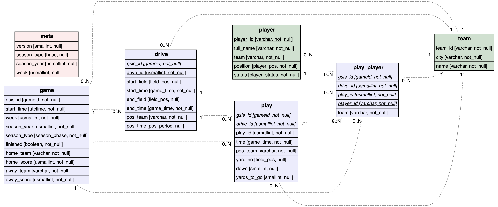

# Exdot

Elixir abstraction for generating Graphviz dot formatted string.

Exdot is NOT a new DSL over Graphviz dot format, it does not try to hide the underlying format. It just helps the user to use programming abstractions to create high-level abstractions or templates for generate the dot file. See [`Exdot.ERD`](https://github.com/akash-akya/exdot/blob/master/lib/exdot/erd.ex). Since Exdot is not hiding anything - you can always configure and generate whatever [graphviz supports](https://graphviz.org/doc/info/attrs.html), and you are never limited by the tool.

Example using `Exdot.ERD`

```elixir
er_diagram do
  entity(
    "player",
    [
      {"player_id", [:varchar, :not_null, :pk]},
      {"full_name", [:varchar, :not_null]},
      {"team", [:varchar, :not_null]},
      {"position", [:player_pos, :not_null]},
      {"status", [:player_status, :not_null]}
    ],
    "#d0e0d0"
  )

  entity(
    "team",
    [
      {"team_id", [:varchar, :not_null, :pk]},
      {"city", [:varchar, :not_null]},
      {"name", [:varchar, :not_null]}
    ],
    "#d0e0d0"
  )

  entity(
    "game",
    [
      {"gsis_id", [:gameid, :not_null, :pk]},
      {"start_time", [:utctime, :not_null]},
      {"week", [:usmallint, :not_null]},
      {"season_year", [:usmallint, :not_null]},
      {"season_type", [:season_phase, :not_null]},
      {"finished", [:boolean, :not_null]},
      {"home_team", [:varchar, :not_null]},
      {"home_score", [:usmallint, :not_null]},
      {"away_team", [:varchar, :not_null]},
      {"away_score", [:usmallint, :not_null]}
    ],
    "#ececfc"
  )

  entity(
    "drive",
    [
      {"gsis_id", [:gameid, :not_null, :fk]},
      {"drive_id", [:usmallint, :not_null, :pk]},
      {"start_field", [:field_pos, :null]},
      {"start_time", [:game_time, :not_null]},
      {"end_field", [:field_pos, :null]},
      {"end_time", [:game_time, :not_null]},
      {"pos_team", [:varchar, :not_null]},
      {"pos_time", [:pos_period, :null]}
    ],
    "#ececfc"
  )


  entity(
    "play_player",
    [
      {"gsis_id", [:gameid, :not_null, :fk]},
      {"drive_id", [:usmallint, :not_null, :fk]},
      {"play_id", [:usmallint, :not_null, :fk]},
      {"player_id", [:varchar, :not_null, :fk]},
      {"team", [:varchar, :not_null]}
    ],
    "#ececfc"
  )
  entity(
    "play",
    [
      {"gsis_id", [:gameid, :not_null, :fk]},
      {"drive_id", [:usmallint, :not_null, :fk]},
      {"play_id", [:usmallint, :not_null, :pk]},
      {"time", [:game_time, :not_null]},
      {"pos_team", [:varchar, :not_null]},
      {"yardline", [:field_pos, :null]},
      {"down", [:smallint, :null]},
      {"yards_to_go", [:smallint, :null]}
    ],
    "#ececfc"
  )

  entity(
    "meta",
    [
      {"version", [:smallint, :null]},
      {"season_type", [:hase, :null]},
      {"season_year", [:usmallint, :null]},
      {"week", [:usmallint, :null]}
    ],
    "#fcecec"
  )

  # Relationships

  relation("player", "team", "1", "0..N")
  relation("game", "team", "1", "0..N")
  relation("drive", "team", "1", "0..N")
  relation("play", "team", "1", "0..N")
  relation("play_player", "team", "1", "0..N")

  relation("game", "drive", "0..N", "1")
  relation("game", "play", "0..N", "1")
  relation("game", "play_player", "0..N", "1")

  relation("drive", "play", "0..N", "1")
  relation("drive", "play_player", "0..N", "1")
  relation("play", "play_player", "0..N", "1")
  relation("player", "play_player", "0..N", "1")
end
```

Generates string which when rendered looks like:




See `examples/` for more exmaples.

> &lt;rant&gt;
>
> Exdot is a collection of helper functions I organically created to help me create pretty ER-Digrams.
>
> After fighting loosing battles with many online and offline tools to create ER-diagram. I gave up looking tools for ER-Diagram specifically and started to search for something more powerful and more generic - so that I can configure it exactly the way I fancy. Graphviz looked exactly that. While searching I came across [ERD](https://github.com/BurntSushi/erd) too, I liked the output but didn't like the approach. New DSL seemed unnecessary as I felt that the under-laying  Graphviz syntax is already simpler. Also, new DSL is not flexible if I want something different. All this while I waited for 30min to install Haskell and Graphviz dependencies, which I eventually rage-quit and found my solace in [graphviz-wasm](https://github.com/hpcc-systems/hpcc-js-wasm).
>
> &lt;/rant&gt;

## Installation

```elixir
def deps do
  [
    {:exdot, "~> x.x.x"}
  ]
end
```

Documentation can be found at [https://hexdocs.pm/exdot](https://hexdocs.pm/exdot).

### License

```text
This program is free software: you can redistribute it and/or modify
it under the terms of the GNU General Public License as published by
the Free Software Foundation, either version 3 of the License, or
(at your option) any later version.

This program is distributed in the hope that it will be useful,
but WITHOUT ANY WARRANTY; without even the implied warranty of
MERCHANTABILITY or FITNESS FOR A PARTICULAR PURPOSE.  See the
GNU General Public License for more details.

You should have received a copy of the GNU General Public License
along with this program.  If not, see <https://www.gnu.org/licenses/>.
```
